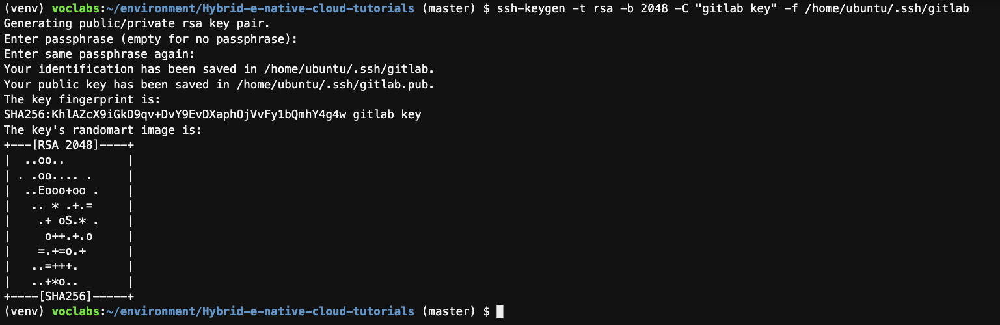
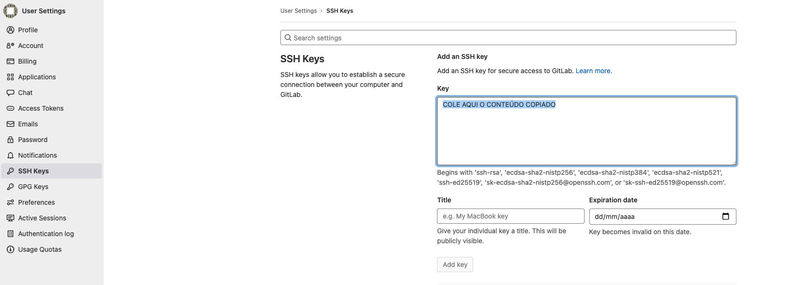
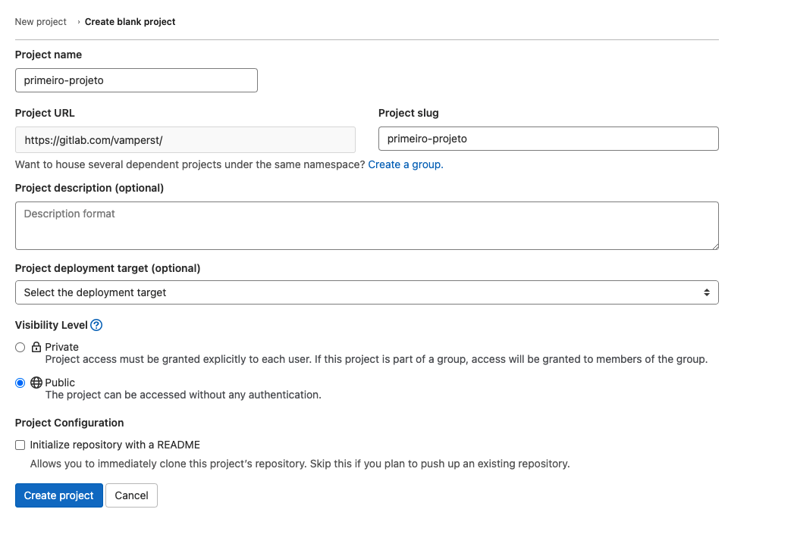
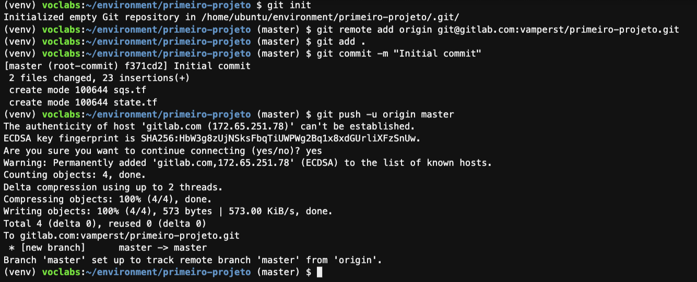
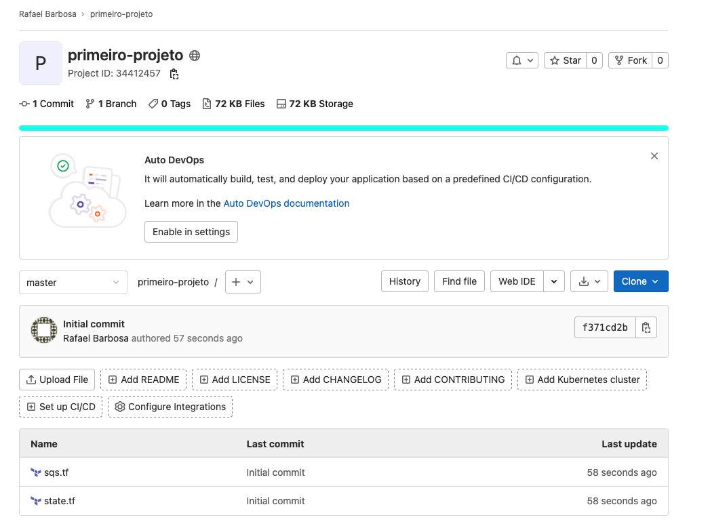
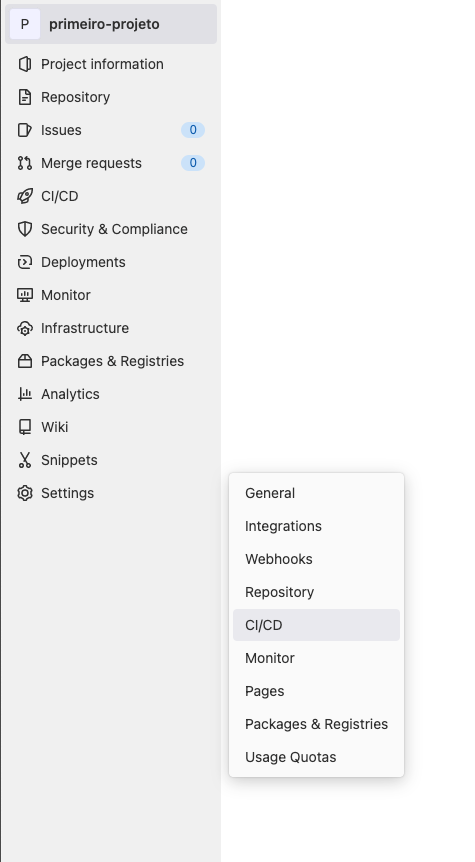
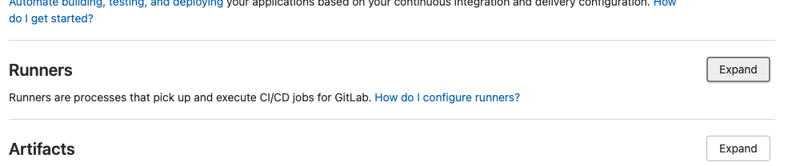
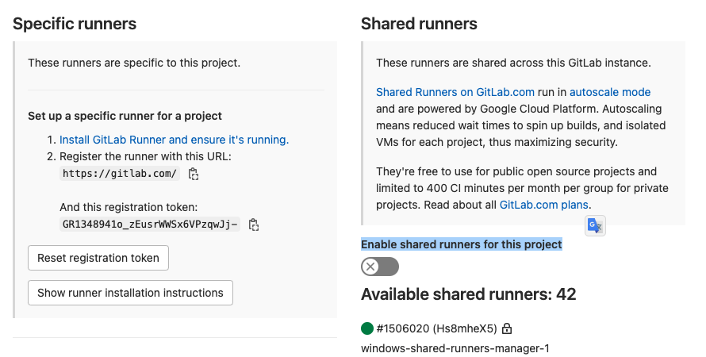

1. Execute o comando `cd ~/environment/Hybrid-e-native-cloud-tutorials/` para entrar na pasta principal do repositório e então execute o comando `git reset --hard && git pull origin master` para garantir que esta com a versão mais atualizada do exercicio.'.
2. Para entrar na pasta do exercicio execute o comando `cd ~/environment/Hybrid-e-native-cloud-tutorials/02-Ansible/01-provisionando-gitlab-runner/`.
3. Primeiramente é necessário instalar o ansible além de atualizar o python e utilizar virtual env. Para tal vamos utilizar a sequência de comandos abaixo.
```bash

#Atualizando o python para 3.8
sudo apt update -y
sudo apt install software-properties-common -y
sudo add-apt-repository ppa:deadsnakes/ppa -y
sudo apt install python3.8 -y
python3.8 --version
sudo update-alternatives --install /usr/bin/python python /usr/bin/python3.8 1
python --version

#Instalando Ansible
sudo add-apt-repository --yes --update ppa:ansible/ansible -y
sudo apt install ansible -y

#Instalando pip3
sudo apt-get -y install python3-pip -y

#Instalando e utilizando virtualEnv
sudo pip3 install virtualenv
python3 -m venv ~/venv 
source ~/venv/bin/activate
```

4. Antes de excutar os scripts para criação do runner do gitlab é necessário criar uma conta no serviço. Caso já tenha, apenas faça o login. [GITLAB](https://gitlab.com/).
5. Para conseguir fazer os commits para o gitlab você irá precisar criar uma chave de conexão. Para tal siga os passos:
   1. Vá ao terminal do Cloud9 e utilize o seguinte comando para criar a chave:
   ```shell
    ssh-keygen -t rsa -b 2048 -C "gitlab key" -f /home/ubuntu/.ssh/gitlab
   ```
   2. Pressione enter duas vezes para sinalizar que não quer senha para a chave
   
   3. Abre a parte publica da sua chave no IDE do cloud9 com o comando `c9 open /home/ubuntu/.ssh/gitlab.pub` e copie o conteúdo para a área de transferência do seu computador.
   4. Acesse o link da configuração de chaves do seu gitlab: [Chaves Gitlab](https://gitlab.com/-/profile/keys)
   5. Cole o conteúdo copiado no campo destacado e clique em `Add Key`
   
   6. Devolta ao terminal do cloud9 exetuce os comandos abaixo para ativar a chave na sessão de terminal que esta utilizando:
   ```shell
    eval $(ssh-agent -s) 
    ssh-add -k /home/ubuntu/.ssh/gitlab
   ```
6. Vamos criar um primeiro projeto no gitlab. Para isso acesse o [link](https://gitlab.com/projects/new). Clique em `Create Blank Projet`.
7. De o nome de `primeiro-projeto` ao projeto. Marque como `Public` e desmarque a opção de inicializar com README. 
   
8. Clique em `Create project`
9. De volta ao Cloud9 você vai subir o código desse primeiro projeto no gitlab. Para isso siga os comandos abaixo tomando o cuidado com os pontos onde precisa colocar suas informações
```bash
git config --global user.name "SEU NOME"
git config --global user.email "SEU EMAIL DO GITLAB"

#Copia o código para outra pasta para que possa criar outro repo git
cp -frv /home/ubuntu/environment/Hybrid-e-native-cloud-tutorials/02-Ansible/01-provisionando-gitlab-runner/primeiro-projeto/ ~/environment/

cd /home/ubuntu/environment/primeiro-projeto

git init --initial-branch=master
git remote add origin git@gitlab.com:vamperst/primeiro-projeto.git
git add .
git commit -m "Initial commit"
git push -u origin master
```



10. No seu repositório do gitlab clique em settings na lateral esquerda e então clique em `CI/CD`
    
11. Em `Runners` clique em `Expand`
    
12. Desabilite a opção `Enable shared runners for this project` 
    
13. 
